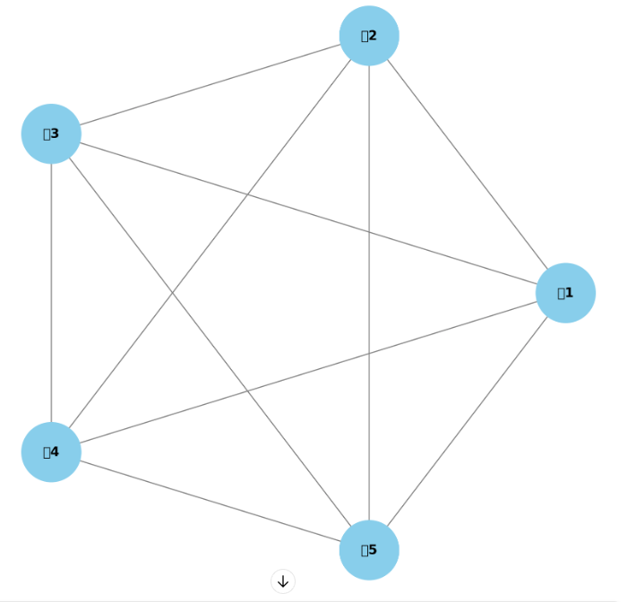
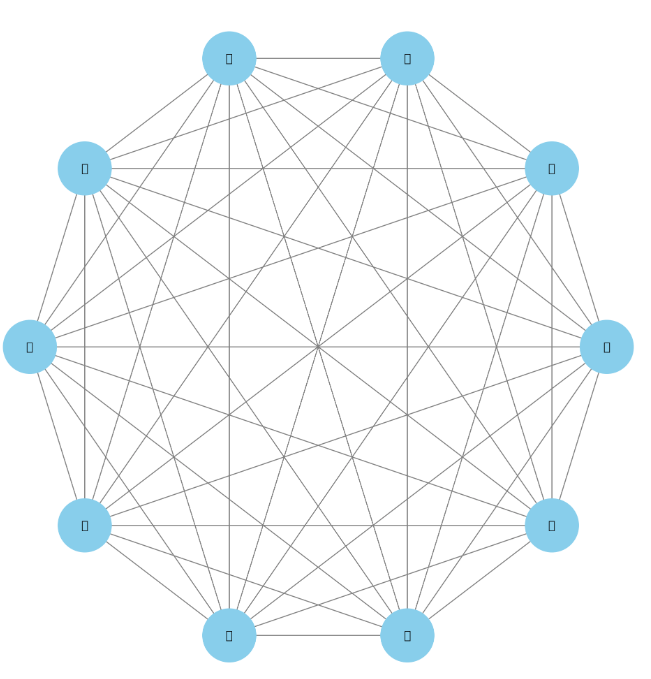
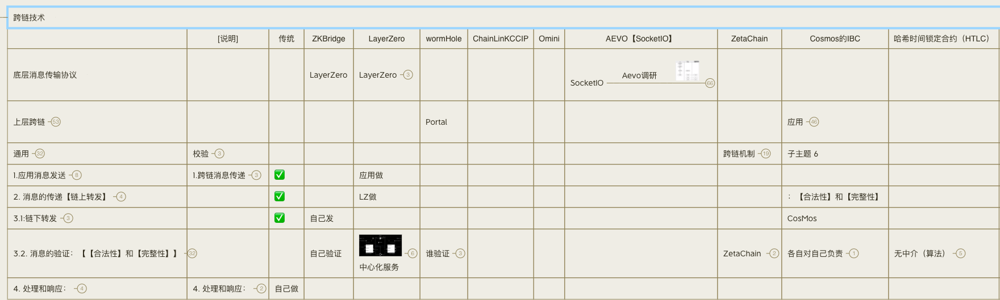
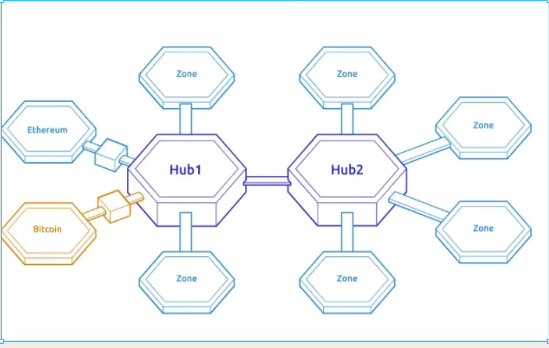
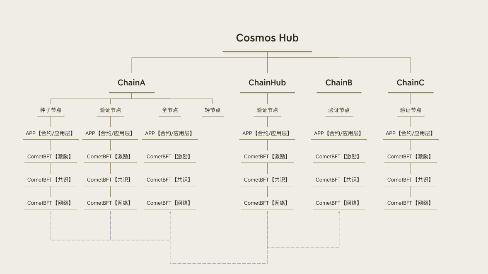
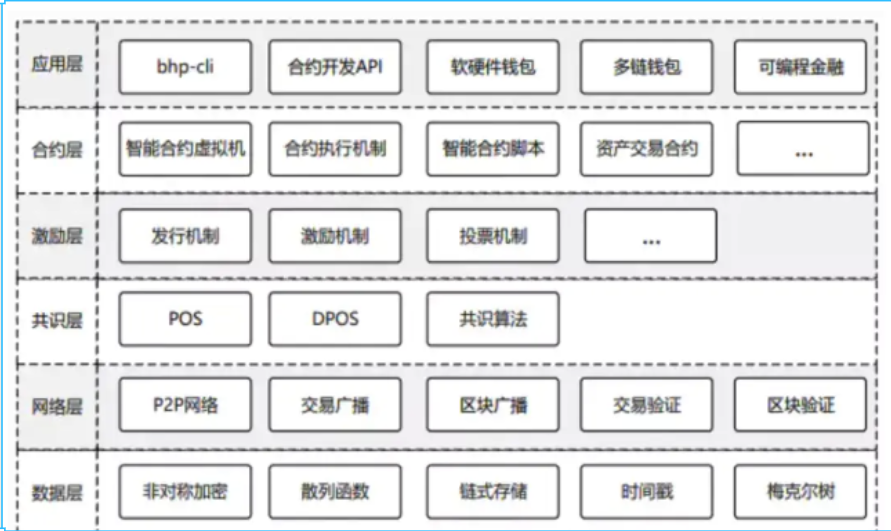
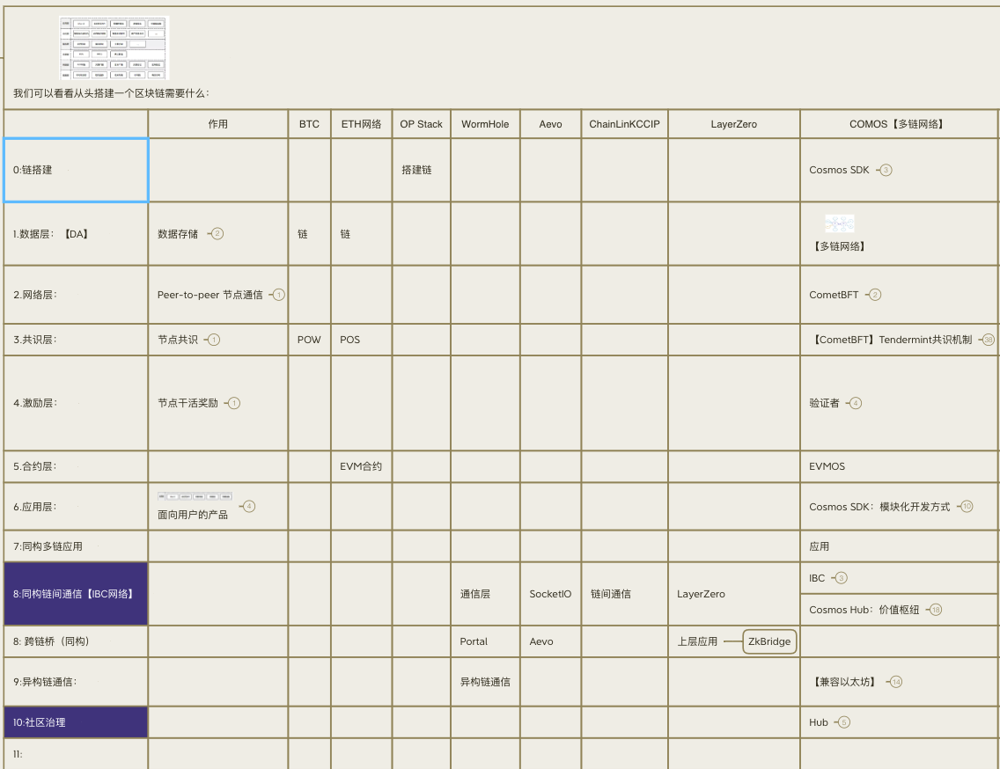

<!-- TOC -->
* [1:ETH存在的问题-通信](#1eth存在的问题-通信)
  * [1.1 ETH完整状态机 =》扩容=》越来越多子链和侧链（脑裂） =》通信](#11-eth完整状态机-扩容越来越多子链和侧链脑裂-通信)
  * [1.2 通信-成本 上升](#12-通信-成本-上升)
  * [1.3 通信-安全 上升-跨链安全](#13-通信-安全-上升-跨链安全)
  * [1.4 代币发行的成本上升](#14-代币发行的成本上升)
  * [结论： 完整状态机 =》代币经济学不可持续](#结论-完整状态机-代币经济学不可持续)
* [2: 如何解决问题=》 总线 + 独立状态机制 【Cosmos】](#2-如何解决问题-总线--独立状态机制-cosmos)
      * [独立状态机制特点](#独立状态机制特点)
* [3:总结 未来分层](#3总结-未来分层)
<!-- TOC -->

# 1:ETH存在的问题-通信

## 1.1 ETH完整状态机 =》扩容=》越来越多子链和侧链（脑裂） =》通信

## 1.2 通信-成本 上升

ETH每条链都和其他的链互通的， 10条链，会产生45个链接；如果有100条链，两两相链就会产生4950个链接。显然，这种做法是不可持续的。

## 1.3 通信-安全 上升-跨链安全

ChainA -> relayer -> hub -> relayer -> ChainB

## 1.4 代币发行的成本上升

1个代币， 10条链， 5个桥 =》 1*5*10

## 结论： 完整状态机 =》代币经济学不可持续

交易速度太慢+交易成本+风险 =》难以构建代币经济学模型

# 2: 如何解决问题=》 总线 + 独立状态机制 【Cosmos】

Cosmos的设计理念是= 万链互联+ 通信总线。100条链只需要99个链接。虽然复杂程度显著减少，
。

1. **独立区块链（zones）**：每个区块链独立状态机。根据需求定制其状态和共识机制。

2. **Tendermint共识引擎**：Tendermint是一个拜占庭容错（BFT）共识算法，用于快速和安全地达成共识。它分为两个部分：Tendermint核心（共识和网络层）和应用块链接口（ABCI，处理应用状态）。

#### 独立状态机制特点

- **模块化设计**：使用Cosmos SDK，开发者可以灵活地组合不同的模块来实现区块链的状态机，包括账户管理、治理、质押、智能合约等。
- **跨链通信**：通过IBC协议，独立的区块链可以互相通信和交换信息，实现跨链操作。
- **高定制化**：每个zone可以根据特定应用的需求定制其状态机和共识机制，提供高度灵活性和扩展性。

# 3:总结 未来分层

当前分层-落后

未来分层- 总线通信 + 独立状态机制

