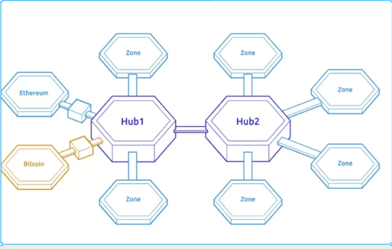

# COSMOS
## 一个分布式账本网络

Cosmos 是一个由独立并行区块链组成的网络，每个区块链都由传统的 BFT 共识算法（如 Tendermint）驱动。

这个网络中的第一个区块链将是 Cosmos Hub。

- 通过IBC通信
- 代币管理
    - 跟踪多种代币类型，
    - 并记录每个连接区域中的代币总量
    - 代币可以在区域之间安全快速地转移，无需在区域之间进行流动性交换，因为所有区域间的币种转移都通过 Cosmos Hub 进行

Cosmos 区域=链。有不同的交易逻辑和经济/治理/安全策略。

IBC实现 同构/异构 跨链通信

通过IBC+ CosmosHub。所有区域间的代币移动都将通过中心枢纽进行。

通过IBC，升级 EVM 将变得无缝，风险较低，不太容易发生有争议的硬分叉。任何人都可以插入一个更好的、升级后的智能合约系统。

我们可以引入其他区块链，并在其自己的区域上建立一个分布式交易所。这可能比中心化交易所更安全。

Cosmos Hub 不是宇宙的中心。任何区域都可以成为一个中心。