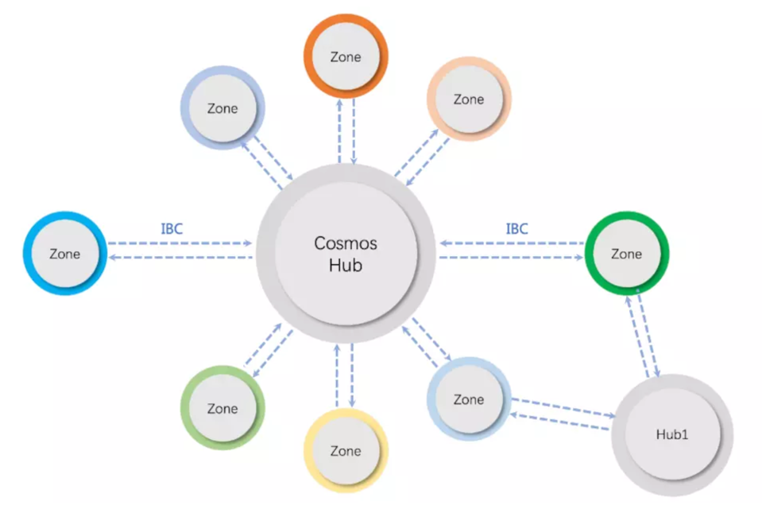
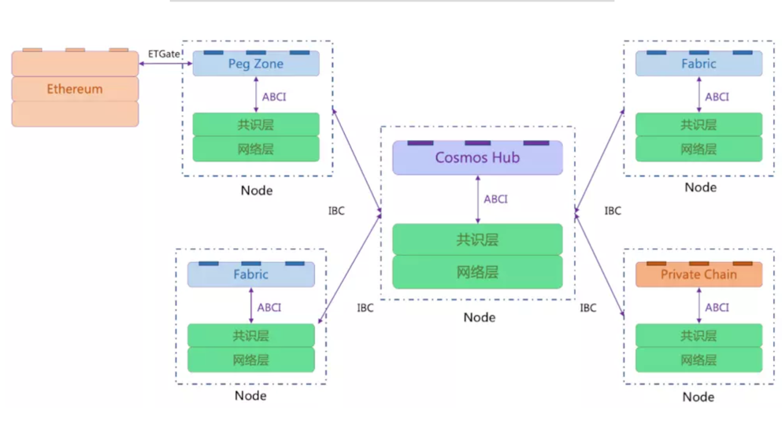

# 1 .网络

https://www.mintscan.io/

Cosmos=网络=*独立的并行区块链组成， 网络中第一个区块链是Cosmos Hub，其他的并行链称为Zone， 通过跨链协议（IBC）与Hub进行跨链操作。

此外对于非Cosmos SDK 开发的区块链需要使用Peg Zone进行桥接，如图中的Ethereum。

# 2 .网络-链

# 2.1 .网络-链-第一条链 Cosmos Hub

- 跨链通信：交换信息和资产
- 安全性： 跨链交易的安全和可靠
- 资产管理： 代币的统一管理，流动性提供
- 治理： 持有 ATOM 代币的用户可以参与治理决策，包括协议升级、参数调整和资金分配等。这种治理机制确保了网络的去中心化和社区参与

# 3 .网络-链-通信 =IBC

链间通信（IBC）协议进行沟通，这种协议就是针对区块链的虚拟用户数据报协议（UDP）或者传输控制协议（TCP）。代币可以安全快速地从一个Zone传递到另一个Zone，两者之间无需体现汇兑流动性。Zome内部所有代币的转移都会通过Cosmos
Hub，它会记录每个Zone所持有的代币总量。这个中心会将每个Zone与其他故障Zone隔离开。

# 4 .网络-链-搭建工具-Cosmos SDK

