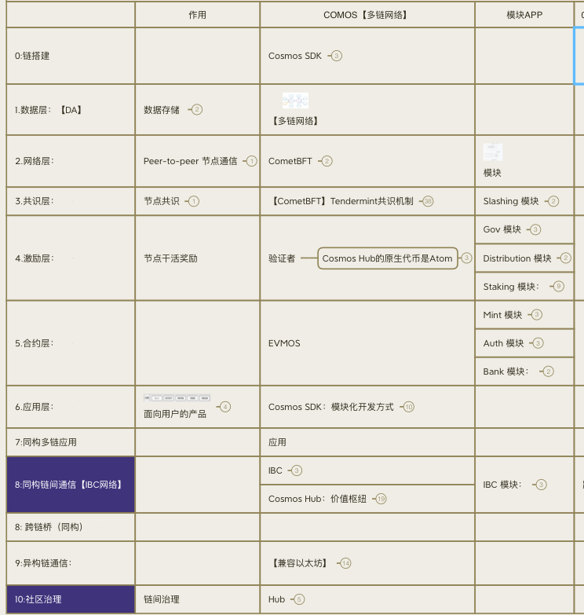

# 1 .网络-链-搭建工具-Cosmos SDK

完整的链需要什么？

* 1:存[tx]    数据   
* 2:同步[tx]  网络层  cometbft
* 3:验证[tx]  共识    cometbft [3-验证-共识](..%2F15-cosmos%E5%88%86%E5%B1%82-%E7%94%9F%E5%91%BD%E5%91%A8%E6%9C%9F%2F3-%E9%AA%8C%E8%AF%81-%E5%85%B1%E8%AF%86)
* 4:奖励惩罚     激励
  - staking：代币质押 ，通货膨胀，挖矿 奖励等操作。
  - Slashing：惩罚验证者的恶意行为
* 5:/逻辑
  - 1:初始化： gentuil：创世区块交易。
  - 2:账户 account：
  - 3:账户安全 auth：交易签名验证。它定义了账户接口，并处理交易的验证和计费
  - 4:代币+-  Mint 管理代币的发行和销毁。
  - 5:代币线性+ -vesting 它允许设置账户的代币在一段时间内逐步解锁。
  - 6:代币分配   distribution：管理从 staking 模块中收集的区块奖励和交易费用，并将其分配给验证者和委托者。
  - 7:账户-代币  - Bank 用于处理账户和代币的转账功能。
  - 8:管理参数 params：区块链的参数（例如，区块时间、费用等）可以通过治理模块动态调整。  - feegrant 授予额度
* 6-7:应用/合约
* 8-9: 账户-代币-跨链划转 ibc：跨链协议IBC的实现，也是Cosmos支持跨链的主要插件。
* 10: 链治理
  - 提建议: governance：治理相关的实现，如提议、投票等。
  - 发现问题：evidence
  - 熔断问题: crisis：用于处理紧急情况。当网络检测到某些不一致或错误时，它可以暂停网络运行，以防止进一步的损失
  - 解决问题： 升级  upgrade。
  - 
Cosmos主要的代码是cosmos-sdk，比如：共识，P2P网络，IBC，账户，治理，认证等。

[cosmos组成-模块.md](cosmos%E7%BB%84%E6%88%90-%E6%A8%A1%E5%9D%97.md)

