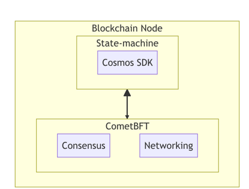
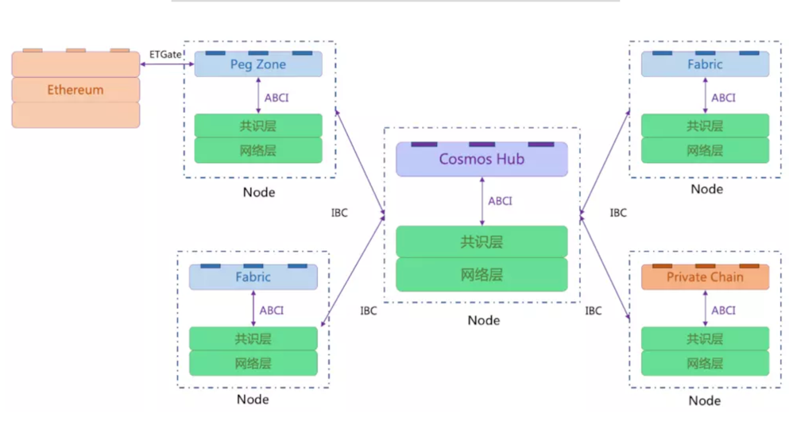
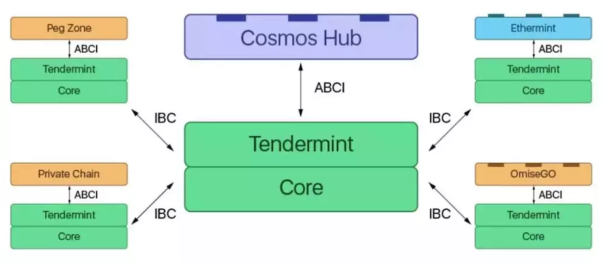
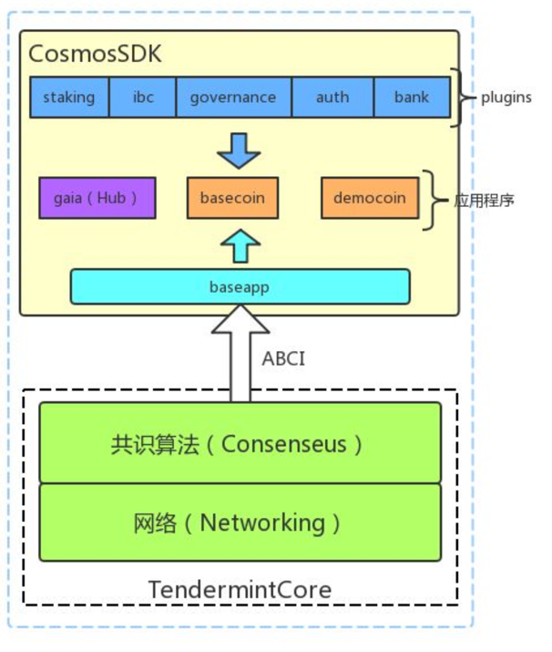
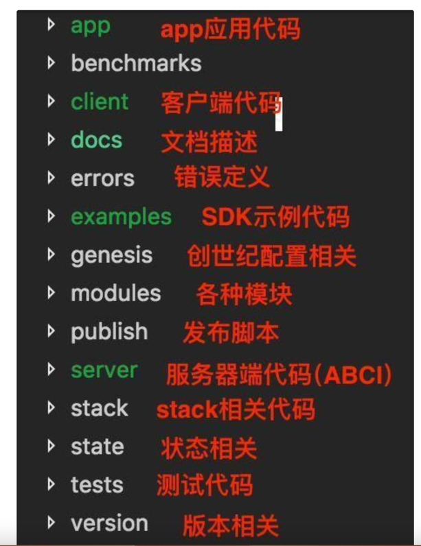

Cosmos网络由许多独立的并行区块链组成，网络中第一个区块链是Cosmos Hub，其他的并行链称为Zone，通过跨链协议（IBC）与Hub进行跨链操作。

此外对于非Cosmos SDK 开发的区块链需要使用Peg Zone进行桥接，如图中的Ethereum。

# 3.Cosmos Hub

Cosmos上的第一个Hub叫做Cosmos Hub。Cosmos Hub是一种多资产权益证明加密货币网络，它通过简单的管理机制来实现网络的改动与更新。
此外，Cosmos Hub还可以通过连接其他Zone来实现扩展。      

Cosmos网络的Hub及各个Zone可以通过区块链间通信（IBC）协议进行沟通，这种协议就是针对区块链的虚拟用户数据报协议（UDP）或者传输控制协议（TCP）。代币可以安全快速地从一个Zone传递到另一个Zone，两者之间无需体现汇兑流动性。Zome内部所有代币的转移都会通过Cosmos Hub，它会记录每个Zone所持有的代币总量。这个中心会将每个Zone与其他故障Zone隔离开。因为每个人都将新Zone连接到Cosmos Hub，所以个Zone今后也可以兼容新的区块链技术。

# 4. Cosmos SDK

从Github上可以看出Cosmos主要的代码是cosmos-sdk，它包含Cosmos Hub的程序代码，同时也是一个区块链开发框架，为其他区块链开发者提供一些通用的功能模块，比如：共识，P2P网络，IBC，账户，治理，认证等。

[cosmos组成-模块.md](cosmos%E7%BB%84%E6%88%90-%E6%A8%A1%E5%9D%97.md)

不难看出cosmos-sdk其实就是一个ABCI应用。主要有：

baseapp：定义了一个基本ABCI应用的模版，与Tendermint通信。开发者也可以根据自己的需求重写。
应用程序：包括gaia、basecoin、democoin。其中gaia就是hub主程序，basecoin以及democoin是提供的两个示例应用。
plugins：cosmos-sdk的基本单元，每个plugin都是baseapp的功能扩展，包含各自的消息和交易处理逻辑。目前SDK已经集成了一些重要的plugin：
-staking：POS相关的实现，包括：绑定，解绑，通货膨胀，费用等操作。
-ibc：跨链协议IBC的实现，也是Cosmos支持跨链的主要插件。
-governance：治理相关的实现，如提议、投票等。
-auth：定义了一个标准的多资产账户结构（BaseAccount），开发者可以直接嵌入自己的账户体系中。
-bank：定义资产的转移。

## 4.1）源代码结构
整个SDK源代码目录如下图所示：

