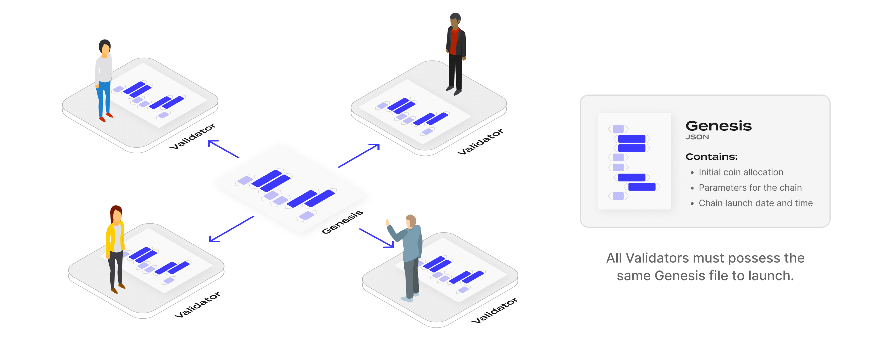
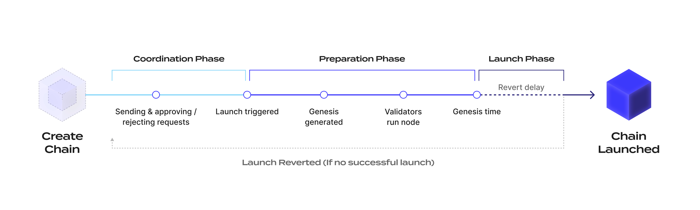

# Ignite Chain

## 介绍

## 什么是 Ignite Chain

Ignite Chain 是一个安全的平台，简化了基于 Cosmos SDK 链的启动，在协调、准备和启动阶段提供关键资源和支持。Ignite 提供区块链项目所需的工具，以克服启动其链的复杂性，从验证者协调和代币发行到筹资和社区建设。

Ignite 通过以下三个阶段的整体启动过程促进新链的启动：

- 协调
- 准备
- 启动

## 验证者协调

为了在 Cosmos 生态系统中启动一条链，验证者必须启动节点并互相连接以创建新的区块链网络。节点必须从一个称为创世文件的文件启动。创世文件在所有验证者节点上必须完全一致，然后新链才能启动。

JSON 格式的创世文件包含链的初始状态的信息，包括代币分配、验证者列表、链的各种参数（如最大活跃签名区块的验证者数量）和特定的启动时间。因为每个验证者都有相同的创世文件，当创世时间到达时，区块链网络会自动启动。

### 作为协调真相来源的 Ignite

Ignite Chain 作为新链协调验证者集和验证者生成链启动创世文件的真相来源。区块链不会直接在其账本中存储最终的创世文件，而是存储允许以确定性方式生成创世文件的信息。

存储在 Ignite 上的信息支持特定链启动的创世文件的确定性生成，被称为 _启动信息_。在 Ignite 上创建新链时，协调者提供初始启动信息。然后，通过链上协调，通过发送消息与区块链互动更新启动信息。当链准备好启动时，通过调用使用启动信息的创世生成算法生成创世文件。

**GenesisGenerate(LaunchInformation) => genesis.json**

创世生成算法是正式指定的。创世生成算法的官方实现是使用 Ignite CLI 用 Go 语言开发的。但是，任何项目都可以自由开发自己的算法实现，只要它符合算法的规范。

创世生成算法不是链上协议的一部分。为了成功启动新链，所有验证者必须使用算法通过启动信息生成他们的创世。该算法从存储在 Ignite 链上的启动信息中确定性地生成创世。

如果启动信息的任何元素被审查，例如删除账户余额，启动的链声誉会受到负面影响，并意味着大多数验证者同意不使用：

- 防篡改的启动信息
- 官方的创世生成算法

在创世生成之外，创世生成算法规范提供关于如何设置网络配置的指导。例如，启动信息可以包含区块链网络的持久对等地址。

## 启动信息

启动信息可以通过三种不同方式创建或更新：

1. 在链创建期间定义，但在创建后由协调者更新
2. 通过协调确定
3. 通过与协调无关的特定链上逻辑确定

### 1 - 在链创建期间确定的启动信息：

- `GenesisChainID`: 网络的标识符
- `SourceURL`: 用于构建区块链节点二进制文件的源代码的 git 仓库 URL
- `SourceHash`: 标识源代码发布的特定哈希
- `InitialGenesis`: 在运行创世生成算法之前为链启动指定的初始创世的多格式结构

### 2 - 通过协调确定的启动信息：

- `GenesisAccounts`: 链的创世账户列表，包括带有相关余额的地址
- `VestingAccounts`: 带有归属选项的创世账户列表
- `GenesisValidators`: 链启动时的初始验证者列表
- `ParamChanges`: 创世状态中的模块参数更改列表

### 3 - 通过链上逻辑确定的启动信息：

- `GenesisTime`: 网络启动的时间戳，也称为 LaunchTime

### 初始创世

启动信息包含初始创世结构。该结构提供在运行创世生成算法之前生成初始创世的信息并最终确定创世文件。

初始创世结构可以是：

- `DefaultGenesis`: 由链二进制 init 命令生成的默认创世文件
- `GenesisURL`: 链启动的初始创世是一个从 URL 获取的现有创世文件，然后通过所需算法修改 - 当初始创世状态包含大量账户进行代币分配时应使用此初始创世类型，包含空投记录
- `GenesisConfig`: 链启动的初始创世是通过包含创世账户和模块参数的 Ignite CLI 配置生成 - 当协调者没有大量状态的初始创世，但需要定制一些模块参数时应使用此初始创世类型。例如，用于质押代币的质押债券标的物

## 协调过程

协调过程在链创建后立即开始，并在协调者触发链启动时结束。

启动信息在协调过程中更新。

在协调过程中，任何实体都可以向网络发送请求。请求是一个对象，其内容指定对启动信息的更新。

链协调者批准或拒绝请求：

- 如果请求被批准，内容将应用于启动信息
- 如果请求被拒绝，则不对启动信息进行任何更改

请求创建者也可以直接拒绝或取消请求。

每条链包含一个请求池，包含所有请求。每个请求都有一个状态：

- _PENDING_: 等待协调者的批准
- _APPROVED_: 被协调者批准，其内容已应用于启动信息
- _REJECTED_: 被协调者或请求创建者拒绝

批准或拒绝请求是不可逆的。唯一可能的状态转换是：

- _PENDING_ 转为 _APPROVED_
- _PENDING_ 转为 _REJECTED_

要撤销请求对启动信息的影响，用户必须发送相反的请求（例如：AddAccount → RemoveAccount）。

由于协调者是请求的唯一批准者，每个由协调者创建的请求会立即设置为 APPROVED，并其内容应用于启动信息。

## 可用请求

可以向 Ignite 链发送六种类型的请求：

- `AddGenesisAccount`
- `AddVestingAccount`
- `AddGenesisValidator`
- `Remove

Account`
- `RemoveValidator`
- `ChangeParam`

**`AddGenesisAccount`** 请求为链创世添加一个新账户，并带有代币余额。该请求内容由两个字段组成：

- 账户地址，必须在启动信息中唯一
- 账户余额

如果启动信息中已存在相同地址的创世账户或归属账户，则该请求自动无法应用。

**`AddVestingAccount`** 请求为链创世添加一个新账户，并带有代币余额和归属选项。该请求内容由两个字段组成：

- 账户地址
- 账户归属选项

当前支持的归属选项是延迟归属，其中在达到结束时间后，账户的总余额中有一部分代币才会归属。

如果启动信息中已存在相同地址的创世账户或归属账户，则该请求自动无法应用。

**`AddGenesisValidator`** 请求为链添加一个新的创世验证者。Cosmos SDK 区块链中的创世验证者代表在创世中已存在余额的账户，在网络启动时自我委托部分余额成为绑定验证者。在大多数情况下，验证者必须首先请求一个账户 `AddGenesisAccount`，然后才请求成为验证者，除非他们在链的初始创世中已有账户和余额。

在创世初始化期间进行自我委托是通过 [Cosmos SDK 模块 genutils](https://pkg.go.dev/github.com/cosmos/cosmos-sdk/x/genutil) 执行的。在创世中，_genutils_ 模块包含称为 gentx 的对象，代表在网络启动前执行的交易。为了在网络启动时成为验证者，未来的验证者必须提供包含从其账户自我委托的 gentx 交易。

该请求内容由五个字段组成：

- 验证者自我委托的 gentx
- 验证者地址
- 验证者节点的共识公钥
- 自我委托
- 验证者节点的对等信息

如果启动信息中已存在相同地址的验证者，则该请求自动无法应用。

**`RemoveAccount`** 请求从启动信息中移除一个创世账户或归属账户。请求内容包含要移除的账户地址。如果启动信息中不存在指定地址的创世账户或归属账户，则该请求自动无法应用。

**`RemoveValidator`** 请求从启动信息中移除一个创世验证者。请求内容包含要移除的验证者地址。如果启动信息中不存在指定地址的验证者账户，则该请求自动无法应用。

**`ChangeParam`** 请求修改创世中的模块参数。Cosmos SDK 区块链中的模块可以有参数来配置区块链的逻辑。参数可以在区块链网络上线后通过治理进行更改。在启动过程中，链的初始参数在创世中设置。

该请求内容由三个字段组成：

- 模块名称
- 参数名称
- 以通用数据表示的参数值

### 请求有效性

在应用请求时，会在链上验证一些检查。例如，创世账户不能重复添加。然而，有些其他有效性属性无法在链上检查。例如，由于 gentx 在区块链中通过通用字节数组表示，因此无法进行链上检查以验证 gentx 是否正确签名或提供的共识公钥是否与 gentx 中的共识公钥一致。这些 gentx 验证是与区块链交互的客户端的责任，以确保请求具有有效格式并允许链的启动。某些有效性检查在创世生成算法中指定。

## 启动过程

通过 Ignite 的链的整体启动过程分为三个阶段：

- 协调阶段
- 准备阶段
- 启动阶段

在协调者在 Ignite 上创建链并提供初始启动信息后，启动过程进入协调阶段，用户可以发送链创世的请求。在协调者认为链已准备好启动后，触发链启动。在此操作期间，协调者提供链的启动时间或创世时间。

一旦启动被触发并且在启动时间到达之前，链启动过程进入准备阶段。在准备阶段，无法再发送请求，链的启动信息被最终确定。验证者运行创世生成算法以获得链的最终创世并准备其节点。剩余时间必须足够验证者准备其节点。这个启动时间由协调者设置，尽管规定了剩余时间的特定范围。

一旦启动时间到达，链网络启动，链启动过程进入启动阶段。此时，由于链已上线，不需要协调者进一步操作。然而，在某些情况下，链可能未能启动。例如，如果创世中的每个验证者未能启动其节点，则链无法启动。

协调者可以撤销链启动。撤销链启动将启动过程退回到协调阶段，允许发送请求以解决与启动失败相关的问题。撤销链启动仅在 Ignite 上生效。如果新链有效启动，则在 Ignite 上撤销启动对链的活跃性没有影响。协调者只能在启动时间加上一个称为撤销延迟的延迟后执行撤销链启动。

## 创世生成

为确保确定性，创世生成规则必须根据链的启动信息严格指定。

创世生成的一般步骤包括：

- 从源代码构建区块链节点二进制文件
- 生成初始创世
- 设置链 ID
- 设置创世时间
- 添加创世账户
- 添加带有归属选项的创世账户
- 为创世验证者添加 gentx
- 从参数更改中更改模块参数