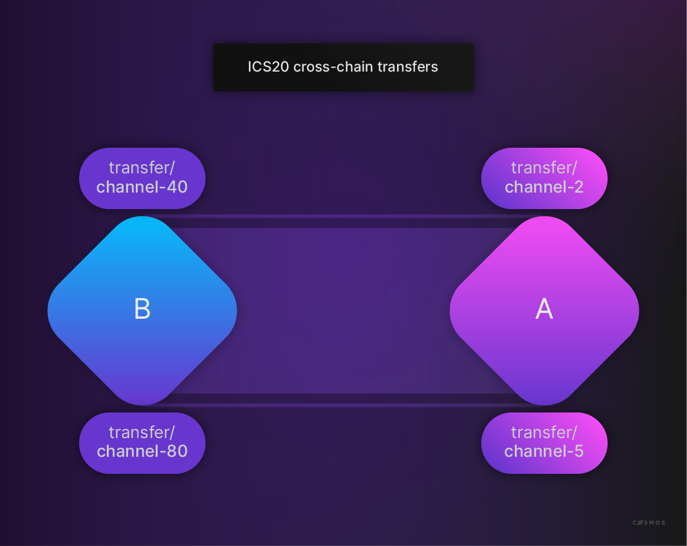
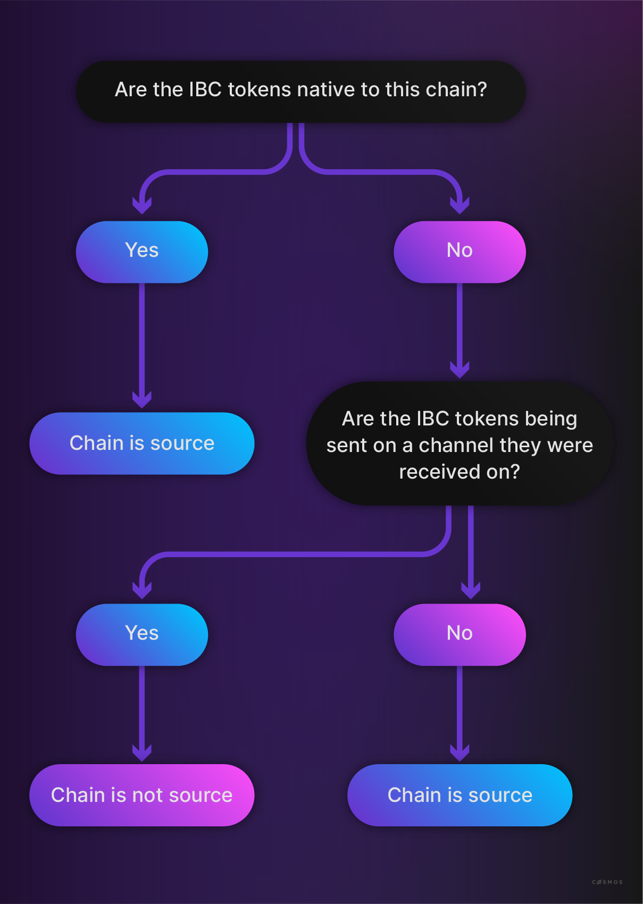
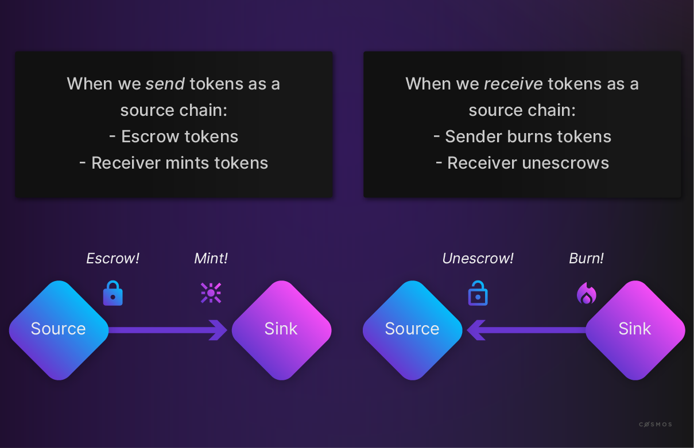
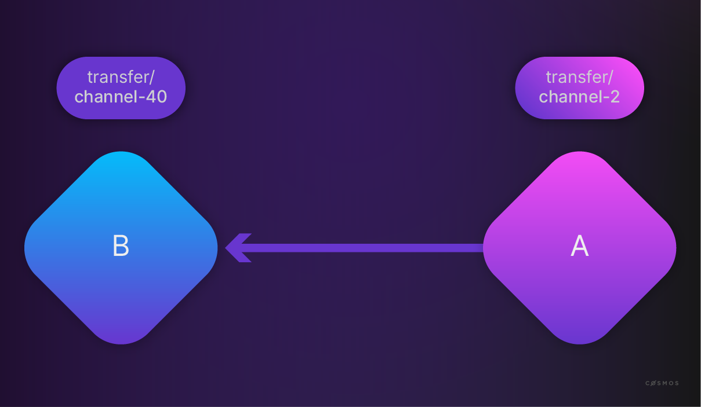
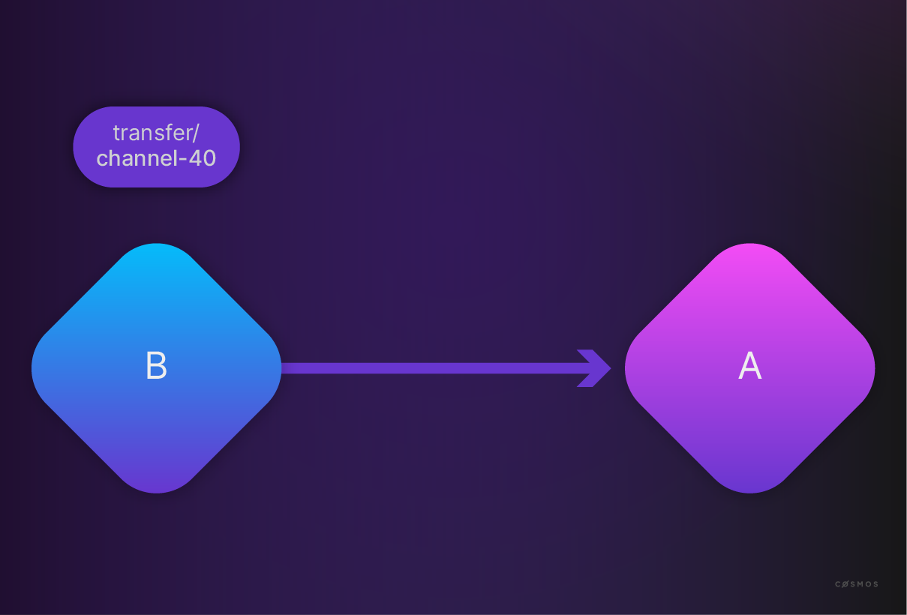
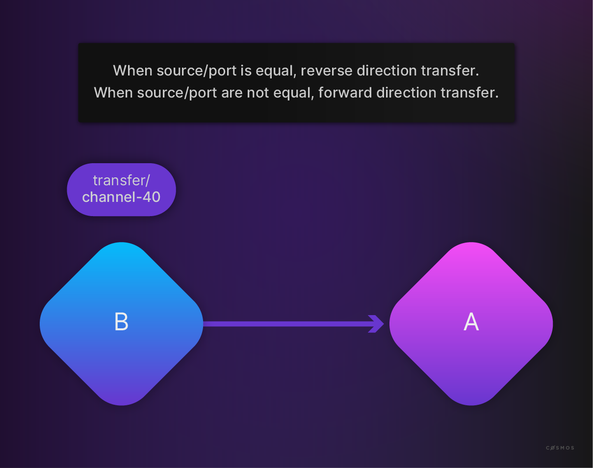

# IBC Token Transfer

<HighlightBox type="learning">

在两条链不兼容时，跨链转移代币既是常见需求，也是一个重大的技术挑战。寻找一个方便的解决方案用于在链之间转移代币是至关重要的。
<br/><br/>
在这个部分，你将探索如何使用IBC进行可互换代币的转移。

</HighlightBox>

在了解了IBC的传输、认证和排序层（IBC/TAO）之后，你现在可以查看 [ICS-20](https://github.com/cosmos/ibc/blob/master/spec/app/ics-020-fungible-token-transfer/README.md)。ICS-20描述了**可互换代币的转移**。

<HighlightBox type="info">

可互换性指的是一个代币是否可以与该代币的其他实例互换。可互换的代币可以进行交换和替换。

</HighlightBox>

在区块链上涉及到许多代币转移的用例，比如代币化的资产持有价值或者用于金融区块链项目的首次代币发行（ICO）。IBC使得可以在（主权）链之间转移可互换和非可互换的代币和其他数字资产。例如，可互换代币转移可以让你构建依赖于跨链支付和代币交换的应用程序。因此，IBC为跨链去中心化金融（DeFi）应用程序释放了巨大潜力，它提供了一个技术上可靠的跨链互操作协议，与多个网络上的数字资产兼容。

相应的 [实现](https://github.com/cosmos/ibc-go/tree/main/modules/apps/transfer) 是应用层的一个模块。



看看上面的图片。你可以看到两条链，A和B。你还可以看到连接两条链的通道。

代币如何在链和通道之间转移呢？

要理解代币转移的应用逻辑，首先，你必须确定**源**链：



然后，应用逻辑可以总结如下：



马上你将看到相应的代码。现在再看一下从**源**到**接收器**的转移：



上图中，**源**是链A。源通道是**channel-2**，目标通道是**channel-40**。代币的名称用`{Port}/{Channel}/{denom}`表示（或者它们在链上的[IBC denom表示](../../2-如何开发一条链/2.1-developer-portal/tutorials/6-ibc-dev/index.md)）。带前缀的端口和通道对表示之前已经通过的通道。你会看到**transfer/channel-...**，因为转移模块将绑定到一个名为transfer的端口。如果链A发送100个ATOM代币，链B将接收100个ATOM代币，并附加目的地前缀**port/channel-id**。因此，链B将以**ibc/<transfer/channel-40/uatom的哈希>**形式铸造这100个ATOM代币。**channel-id**将在给定连接上逐个递增。

<HighlightBox type="note">

我们可以在多条链上的多个_hop_中发送资产（或它们的IBC凭证表示）。每次路径都会以_port/channel-id/..._前缀开头。
</br></br>
将这个IBC代币（经过多次跳跃）发送回其源链时，每次回跳都会取下一个_port/channel-id/..._前缀。如果所有的跳跃都被逆转，那么就会回到原始的denom。

</HighlightBox>

如果代币从**与接收器相同的通道**发送回来：



链A将“取消托管”100个**ATOM代币**，因此，前缀将被移除。链B将烧毁**transfer/channel-40/atoms**。

<HighlightBox type="note">

前缀确定了**源**链。如果模块将代币从另一个通道发送，那么链B就是源链，链A会用前缀而不是取消托管ATOM代币来铸造新的代币。你可以在两条链之间有不同的通道，但你不能在不同的通道之间来回转移相同的代币。如果`{denom}`包含`/`，那么它也必须遵循ICS-20的形式，这表明这个代币有一个多跳记录。这要求非IBC代币的名称中禁止使用字符`/`。

</HighlightBox>



你已经知道，应用程序需要实现[IBC模块接口](https://github.com/cosmos/ibc-go/blob/v5.1.0/modules/core/05-port/types/module.go)，所以看看代币转移的 [实现](https://github.com/cosmos/ibc-go/blob/v5.1.0/modules/apps/transfer/ibc_module.go)，例如 `OnChanOpenInit`：

```go
// OnChanOpenInit 实现了 IBCModule 接口
func (im IBCModule) OnChanOpenInit(
    ctx sdk.Context,
    order channeltypes.Order,
    connectionHops []string,
    portID string,
    channelID string,
    chanCap *capabilitytypes.Capability,
    counterparty channeltypes.Counterparty,
    version