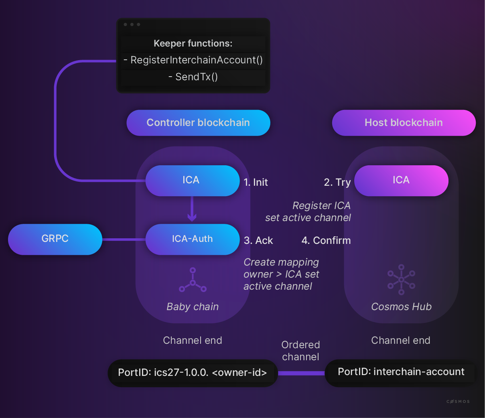

# 互链账户

<HighlightBox type="learning">

**互链账户（ICA）**允许你从一个**控制链**上控制一个**主机链**上的账户。
  
在本节中，你将了解更多关于：

* 主机链和控制链
* ICA（子）模块
* 用于自定义认证的认证模块
* 用于次要应用逻辑的ADR 008中间件

</HighlightBox>

## 什么是互链账户？

由IBC实现的可互操作区块链互联网为跨链交互和利用这些基本功能的应用程序开辟了许多新的前沿。在这个互操作性叙事中，应该可以通过远程接口与给定的链（称为_主机链_）进行交互，即从另一个链（_控制链_）上进行。互链账户（简称ICA）就是实现这一目标的工具：它们允许链、模块或该链上的用户以编程方式控制远程链上的一个账户（即互链账户）。

有时互链账户也被称为_跨链写入_。这是与跨链查询（ICQ）或从远程链读取数据的能力（即_跨链读取_）相结合的，即跨链查询和跨链写入。

描述互链账户应用程序协议的规范是 [ICS-27](https://github.com/cosmos/ibc/tree/main/spec/app/ics-027-interchain-accounts)。

<HighlightBox type="docs">

ICA的ibc-go实现可以在 [apps子目录](https://github.com/cosmos/ibc-go/tree/main/modules/apps/27-interchain-accounts) 中找到。
  
相应的文档可以在 [ibc-go文档](https://ibc.cosmos.network/main/apps/interchain-accounts/overview.html) 中找到。

</HighlightBox>

## ICA核心功能：控制器和主机

从上面的描述中，需要区分所谓的“主机”和“控制器”链。与ICS-20不同，后者在本质上是双向的，因为两个链都可以使用转账模块发送和接收令牌，ICA具有更单向的设计。只有控制链才能发送可执行逻辑到通道上，该逻辑将始终在主机链上执行。

以下是与ICA相关的几个重要定义：

**主机链：** 注册互链账户的链。主机链会监听来自控制链的IBC数据包，这些数据包应该包含互链账户将执行的指令（例如cosmos SDK消息）。

**控制链：** 注册和控制主机链上账户的链。控制链会向主机链发送IBC数据包，以控制该账户。

<HighlightBox type="info">

互链账户应用程序模块被设计为**支持独占地启用控制器或主机功能**。通过仅仅省略互链账户的`NewAppModule`构造函数中的控制器或主机`Keeper`，并通过`IBCRouter`挂载仅所需的子模块，就可以实现这一点。此外，[可以使用链上参数动态启用和禁用子模块](https://ibc.cosmos.network/main/apps/interchain-accounts/parameters.html)。

</HighlightBox>

**互链账户（ICA）：** 主机链上的一个账户。互链账户具有普通账户的所有功能。但是，与使用私钥签署交易不同，控制链的认证模块将发送IBC数据包到主机链，这些数据包包含了互链账户应该执行的交易。

**互链账户所有者：** 控制链上的一个账户。主机链上的每个互链账户都有一个对应的所有者账户在控制链上。这个所有者账户可以是模块账户（在Cosmos SDK链上）或类似的账户，它不严格限制在普通用户账户上。

现在是时候看一下控制器和主机两端的API了。

